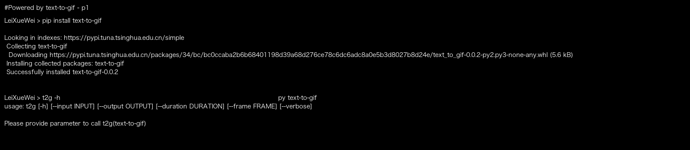
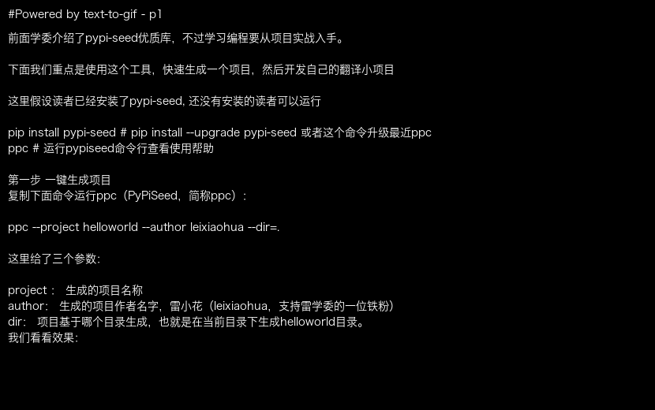

# text-to-gif

AKA t2g or text-to-gif-cli on pypi

Well, I didn't find a python lib to process the text as gif.

So I developed this.

It can help me to create gif with code execution result if I don't have change to upload the live-running video.


t2g(text-to-gif) 支持开发者把文本转化为gif进行动态播放。

学委写了很多文章都是贴静态图的，今年改进一下，发现市场没有这样的。所以用python写了一个小工具。

支持把 文本/代码 转化为gif 动态展示。


Powered by [pypi-seed](https://pypi.org/project/pypi-seed/)


# Installation / 安装

Get t2g by pip (通过PIP工具来安装text-to-gif)
```bash
pip install text-to-gif
```

Print the usage

```bash
t2g -h
```



# Use text-to-gif as CLI / 命令行使用

We can call the cli 't2g' or 'text-to-gif' or 'ttg'： \
调用下面两个命令行即可。

```bash
t2g -p /Users/mac/PycharmProjects/hello/xuewei_pypi_blog.txt -d ./blog.gif -f 5
```

```bash
ttg -p /Users/mac/PycharmProjects/hello/xuewei_pypi_blog.txt -d ./blog.gif -f 5
```

```bash
text2gif -p /Users/mac/PycharmProjects/hello/xuewei_pypi_blog.txt -d ./blog.gif -f 5
```

The above command will generate below gif:



# More Info
Author levin